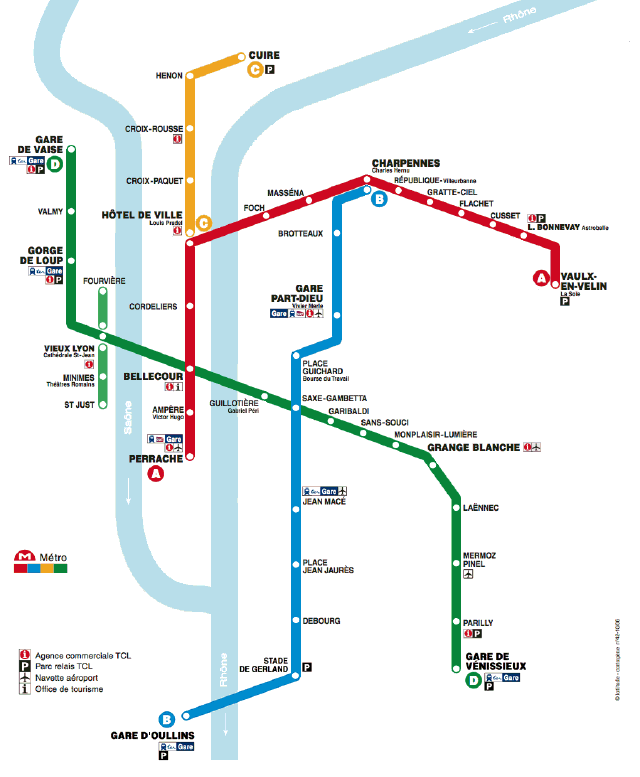

# Algo_TP_TCL

Refactor d'une application de calcul d'itinéraire sur le métro lyonnais (réseau de 2013).

Le code a été modifié pour : 
- passer des variables en constantes grâce au mot clé *final*
- différencier les fonctions des prodécures
- pointer les fonction idempotentes et/ ou pures
- pointer l'utilisation de la composition au lieu de l'héritage
- 
Marion PLAYOUT ESGI M2 Architecture Logicielle
